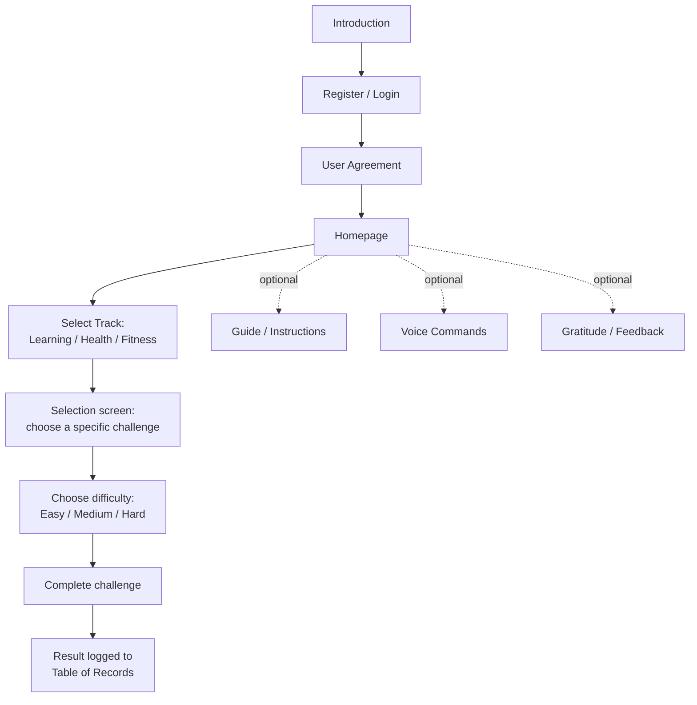

# Learning Challenge System

A gamified Windows desktop application for students that blends academic learning, health habits, and physical fitness into a single set of tiered challenges. Built in C# with Windows Forms.

> Status: School capstone / prototype project. Audience: students.

---

## Overview

Learning Challenge System turns self-improvement into a game. After registering and logging in, a student lands on a homepage with three tracks — **Learning**, **Health**, and **Fitness** — each broken into individual challenges (math drills, reading exercises, hydration habits, bodyweight exercises, and more), and each challenge offered at **Easy**, **Medium**, and **Hard** difficulty. Every track has its own guide, description screens, and optional voice-command support, and completed attempts are logged to a records table so students can track their progress over time.

---

## Key Features

- **Account system** — registration, login, password change, and a user agreement/terms step before first use
- **Three challenge tracks** — Learning, Health, and Fitness, each with a dedicated selection screen
- **Tiered difficulty** — most challenges are offered in Easy, Medium, and Hard versions
- **Guides and descriptions** — each track has its own guide and description screens, plus targeted instruction screens for specific challenge types
- **Voice command support** — dedicated voice-command modules for the Learning, Health, and Fitness tracks
- **Progress tracking** — a records table (leaderboard-style) logs completed challenges
- **Gratitude journaling** — a reflective exercise alongside the more structured challenges
- **Feedback collection** — an in-app feedback form
- **JSON-based data handling** — a helper module reads/writes challenge and progress data as JSON

---

## Challenge Tracks

### Learning
Arithmetic (Addition, Subtraction, Multiplication, Division), Math Equations, Math Puzzles (with separate "Try" practice modes), Pattern Recognition, Grammar exercises, Book Summary, Story Retelling, Reading Time, Budget Problems, and Real-Life Application scenarios.

### Health
Hydration, Hold-Breath, Take-a-Cold-Shower, and Gratitude challenges — habit-building exercises focused on wellness rather than physical exertion.

### Fitness
Push-Ups, Squats, Planking, Side Plank, Wall Sit, Bear Crawl, Bicycle Crunches, Mountain Climbers, Reverse Lunges, Russian Twist, Side Lunges, Toe Touches, and Walking — bodyweight exercise challenges.

A separate **Time Challenge** mode adds a timed element on top of these.

---

## How It Works

---

## Tech Stack

`C#` `.NET` `Windows Forms` `JSON`

---

## Author

Built by [Exequiel Kent T. Bartolome](https://github.com/EXEQUIELKENT).
